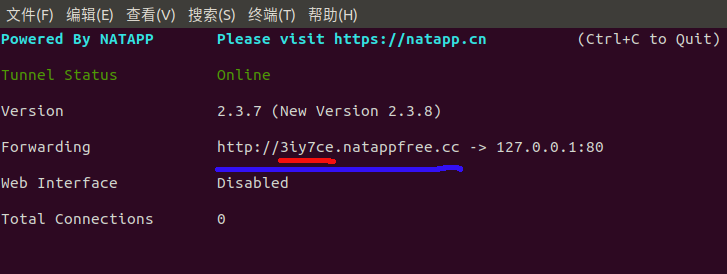
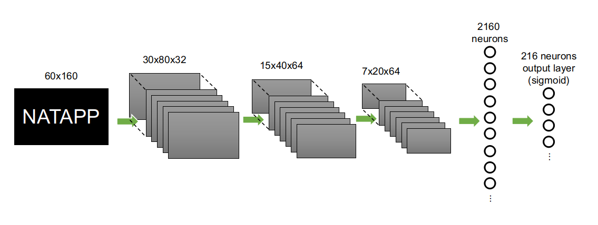

# crack_natapp

Keras（Tensorflow后端）实现的一个多层CNN网络，用于获取Natapp随机生成的网址。

# 环境

系统：Ubuntu 18.04 

框架：Keras

后端：Tensorflow

GPU：GeForce GTX 1060 6GB

# 背景

[NATAPP](https://natapp.cn/)是基于ngrok的国内高速内网穿透服务。NATAPP提供免费隧道，用来做微信公众号的后台很好。NATAPP运行效果如下图所示。蓝色下划线标注部分为外网地址，红色下划线标注部分为随机生成的6个字符。随机分配的字符（红色下划线部分），每隔大约48小时就改变一次。所以用的时候总得盯着它改变，变了以后得及时在微信公众号后台更新地址。



*<center>图1. NATAPP窗口</center>*

因此，想到了将窗口截图，然后利用卷积神经网络进行字符识别。当监控到地址改变后再利用python模拟登录微信公众号的后台更新地址。这样除了识别字符出现错误，基本就不用操心了。本项目只包括CNN识别地址的部分，模拟登陆微信后台部分不包括。

# 文件结构

gen_link.py: 用于生成训练和测试数据，根据我终端窗口的字体和字号生成图片。图片内容为6位随机字母和数字。字体为MONACO，字号19。可以根据你的系统情况加以更改。

train.py: 构建CNN网络模型，利用生成的训练数据对模型进行训练，保存训练好的模型。

test_model.py:用来测试训练好模型的准确度。

my_model_architectrue.json:模型结构文件。

my_model_weights.h5:模型权重文件。

MONACO.TTF：monaco字体文件。

# 模型结构

模型组成为：一个输入层输入60x160的灰度图片，一个32核心的卷基层（卷积核为5x5，步长2x2），一个池化层（池化核2x2，步长2x2），一个64核心的卷基层（卷积核为5x5），一个池化层（池化核2x2），再接一个64核心的卷基层（卷积核为5x5），一个池化层（池化核2x2），之后为一个2160个神经元组成的全连接层，最后输出层为216个神经元。模型结构如下图所示，图中省略了池化和dropout。



*<center>图2. 多层CNN结构图</center>*

# 训练模型

训练数据集为的60000个图片，测试数据为10000个图片，损失函数选择交叉熵损失函数。随机梯度下降batch大小为1000。每10个epochs判断一下识别精度，当训练数据精度达到99.5%以上并且在测试数据上的精度达到99.9%以上后停止训练。在我的系统上训练大约持续了1小时左右。

# 应用模型

截取窗口图片，然后利用训练好的模型识别地址。截取窗口图片的代码windows和linux系统下不太一样，这里不赘述。主要思路是截图，将图片喂给模型，模型输出地址。代码如下：

``` 
# -*- coding: utf-8 -*-
from keras import backend as K
from keras.models import model_from_json 
import numpy as np

K.set_image_dim_ordering('tf')
IMAGE_HEIGHT = 60
IMAGE_WIDTH = 160

def convert2gray(img):
    if len(img.shape) > 2:
        gray = np.mean(img, -1)
        return gray
    else:
        return img

def vec2text(vec):
    char_pos = vec.nonzero()[0]
    if char_pos.shape[0]!=6:
        #print(vec)
        #print(char_pos)
        return '######'
    text=[]
    for i in range(MAX_link):
        char_index = char_pos[i]-36*i
        if char_index >36:
            return '******'
        else:
            char = charlist[char_index]
            text.append(char)
    return "".join(text)

def binoutput(vec):
    bvec = np.zeros(MAX_link*CHAR_SET_LEN)
    for m in range(MAX_link):
        temp = vec[m*36:(m+1)*36]
        maxindex = np.where(temp==temp.max())[0][0]
        #print(maxindex)
        bvec[maxindex+m*36] = 1
    return bvec
    
def crack_link(link_image):
    # load model
    json_file = open('my_model_architecture.json', 'r')
    loaded_model_json = json_file.read()
    json_file.close()  
    model = model_from_json(loaded_model_json)
    model.load_weights('my_model_weights.h5')

    x = np.zeros([1, IMAGE_HEIGHT, IMAGE_WIDTH])
    x[0,:] = link_image
    x = x.reshape(x.shape[0], IMAGE_HEIGHT, IMAGE_WIDTH, 1).astype('float32')
    x = x / 255

    result = model.predict(x)
    result = binoutput(result[0])
    char_result = vec2text(result)
    return char_result

def getpic(title)
	#这里是实现窗口截图的代码，参数title应为窗口名称
	#注意截图只截取图1红色下划线标注部分

im=getpic('window_name')
address = 'http://'+crack_link(im)+'.natappfree.cc'
```

